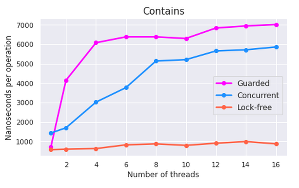
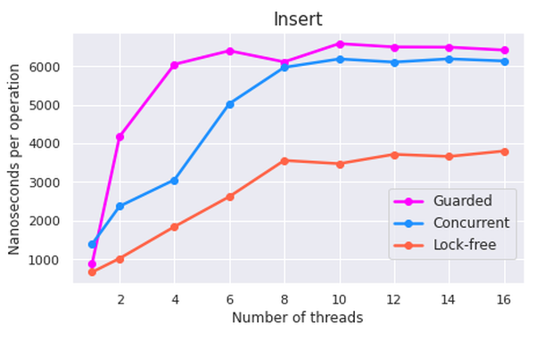
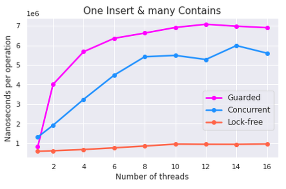

# Skipper

## What is it?

__Skipper__ is a C++17 header-only library with various implementations of __Skip List__ data structure.

## Benchmark results

For measuring performance [Google Benchmark library](https://github.com/google/benchmark) was used. Source code of benchmarks can be found [here](https://github.com/TmLev/skipper/tree/master/benchmarks).

3 experiments with different setups (described below) have been conducted. Every benchmark ran on several number of threads (from 1 to 16). Performance was measured on Intel Core i7-8565U x86-64 with 8 hyper-threading cores with 1.8 CHz base frequency and 4.6 max turbo frequency. RAM is 32 GB DDR4.

### Contains
This benchmark tests `Contains()` method. As a setup 10^6 random numbers from `R = (-10^4; 10^4)` are inserted. 

### Insert
Here `Insert()` method performance is measured. For setup 10^3 random numbers from `R = (-10^3; 10^3)` are inserted.

### One Insert & Many Contains
Here both methods are tested. 10^4 random numbers from `R = (-10^4; 10^4)` are inserted for a setup. During benchmarks itself one thread inserts random numbers from `R` the endless loop, while other threads are checking for contains random numbers from `R`.

## How to use?

* Examples can be found [here](docs/examples.md).
* Drop headers from [`include/skipper`](include/skipper) directory in your project or use [CMake](docs/cmake.md).

## How to contribute?

Feel free to open an issue if something is wrong. 
For pull requests please follow [these](docs/contributing.md) instructions.
